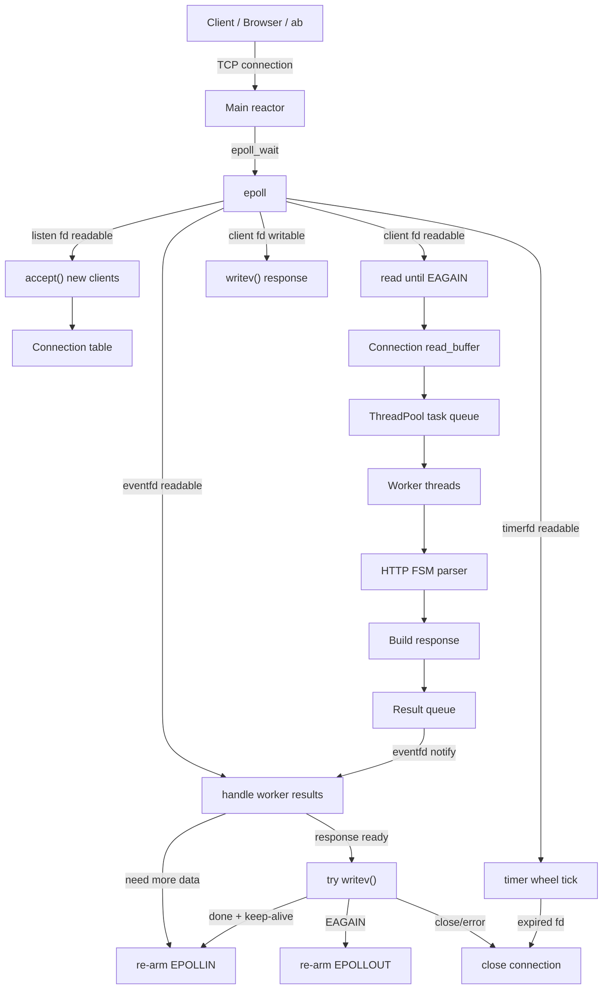
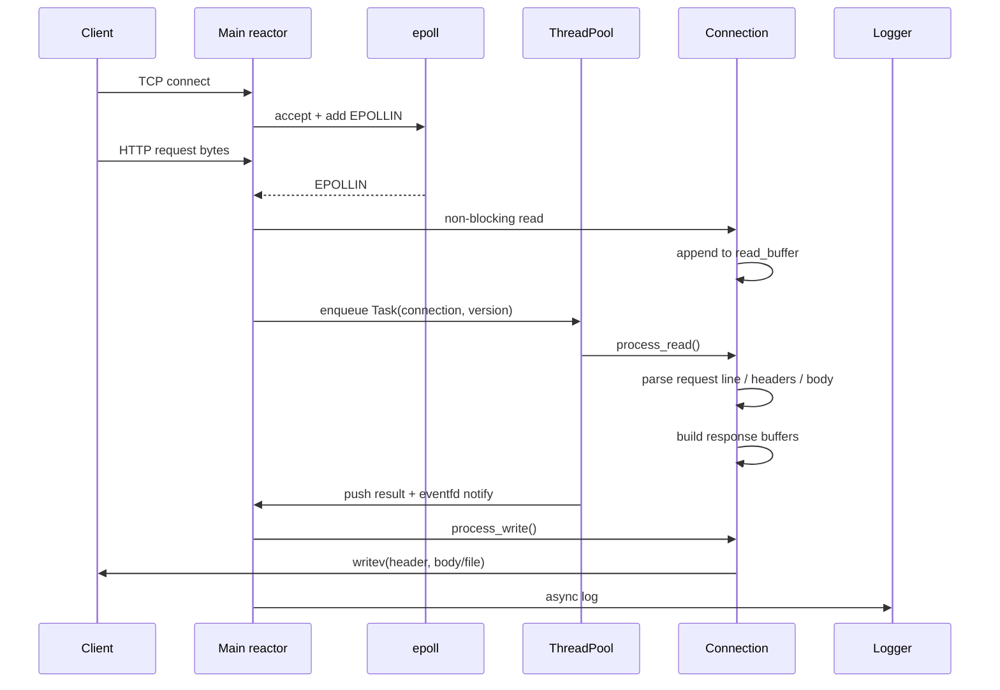
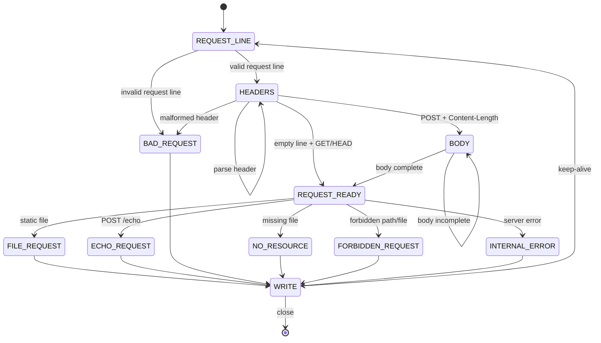
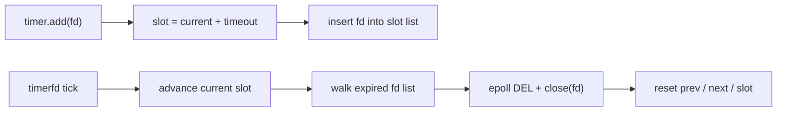

# VWebServer

[简体中文](./README.zh-CN.md) | English


VWebServer is a Linux HTTP/1.1 web server written from scratch in C++14. It is built to make the moving parts of a high-concurrency server visible: non-blocking sockets, `epoll`, edge-triggered event dispatch, worker-thread scheduling, HTTP state-machine parsing, idle-connection timeout management, static-file serving, asynchronous logging, command-line configuration, and graceful shutdown.

It is not trying to replace Nginx. It is a compact systems-programming project that shows how a web server can be assembled from Linux primitives and a small set of C++ modules.

## Highlights

- Event-driven network loop based on `epoll`
- Non-blocking listening and client sockets
- Edge-triggered `EPOLLET` event handling
- `EPOLLONESHOT` for client read events to avoid duplicated processing
- Worker thread pool for HTTP parsing and response preparation
- `eventfd` notification from workers back to the main reactor
- HTTP/1.1 `GET`, `HEAD`, and `POST /echo`
- Keep-Alive connection reuse
- Incremental parser that handles partial packets, sticky packets, and simple pipelined requests
- Static file responses from `Resources/`
- `mmap()` plus `writev()` for header + file transmission
- `timerfd` driven timing loop
- Timer wheel for idle-connection timeout cleanup
- Per-connection version number to ignore stale worker tasks after fd reuse
- Asynchronous logger with level filtering and size-based log rotation
- Command-line configuration for port, thread count, timeout, connection limit, log path, log level, and log size
- Graceful shutdown through `SIGINT` and `SIGTERM`

## Architecture

VWebServer uses a single main reactor thread plus a worker pool.

The main thread owns the listening socket, `epoll` instance, timer, connection table, and all socket lifecycle operations. Worker threads only process queued connection tasks: they run the HTTP parser, build response metadata, and push completed connections back to the result queue. The result queue wakes the reactor with `eventfd`, so socket writes and epoll re-arming stay centralized.



## Request Lifecycle



## HTTP Support

The parser is a small finite-state machine around request line, headers, and optional body parsing.



Supported behavior:

| Area | Details |
|---|---|
| Methods | `GET`, `HEAD`, `POST /echo` |
| Body parsing | `Content-Length` based request body parsing |
| Static root | `Resources/` |
| Default page | `/` maps to `/index.html` |
| Path safety | rejects `..` and `%2e%2e` traversal attempts |
| Error pages | `400`, `403`, `404`, `500` |
| MIME types | `html`, `css`, `js`, `png`, `jpg/jpeg`, `gif`, `ico`, `svg`, `txt`, `json`, `pdf`, fallback `application/octet-stream` |

## Static File Path

For `GET`, VWebServer checks file metadata with `stat()`, rejects directories and unreadable files, maps the file with `mmap()`, then sends response headers and file content with `writev()`.

For `HEAD`, it builds the same headers but sends no file body.

For `POST /echo`, it returns the request body as `text/plain`.

## Timeout Model

Idle connections are tracked by a timer wheel. A `timerfd` fires once per second; each tick advances the current slot and closes expired file descriptors. Connections are removed from the wheel while they are being read and re-added after the server returns to waiting for more data.



## Logging

The logger is a singleton asynchronous logger. Application threads format log messages and push them into a queue; a background thread writes them to disk. It supports `DEBUG`, `INFO`, `WARN`, `ERROR`, and `FATAL`, includes timestamp, source file, and line number, and rotates log files when the configured size limit is reached.

## Project Layout

```text
.
├── main.cpp
├── Makefile
├── Config/
│   ├── Config.h
│   └── Config.cpp
├── Connection/
│   ├── Connection.h
│   └── Connection.cpp
├── Logger/
│   ├── Logger.h
│   └── Logger.cpp
├── ThreadPool/
│   ├── ThreadPool.h
│   └── ThreadPool.cpp
├── TimerWheel/
│   ├── TimerWheel.h
│   └── TimerWheel.cpp
├── WebServer/
│   ├── WebServer.h
│   └── WebServer.cpp
├── Resources/
│   ├── index.html
│   ├── favicon.ico
│   └── readme-hero.svg
└── Logs/
```

## Build

Requirements:

- Linux
- `g++` with C++14 support
- `make`
- POSIX/Linux APIs including `epoll`, `eventfd`, `timerfd`, `mmap`, and `writev`

Build:

```bash
make
```

Clean binary:

```bash
make clean
```

Clean logs:

```bash
make clean-logs
```

## Run

Default configuration:

```bash
./server
```

Custom configuration:

```bash
./server \
  --port 8080 \
  --thread-nums 8 \
  --timeout 60 \
  --max-conn 65535 \
  --log-dir Logs \
  --log-level INFO \
  --log-size 10485760
```

Then open:

```text
http://127.0.0.1:8080/
```

Options:

| Option | Description | Default |
|---|---|---|
| `--port` | Listening port | `8080` |
| `--thread-nums` | Worker thread count | `8` |
| `--timeout` | Idle connection timeout in seconds | `60` |
| `--max-conn` | Maximum connection table size | `65535` |
| `--log-dir` | Log directory | `Logs` |
| `--log-level` | Minimum log level | `DEBUG` |
| `--log-size` | Max size of one log file in bytes | `10485760` |

## Quick Checks

```bash
curl -i http://127.0.0.1:8080/
curl -I http://127.0.0.1:8080/index.html
curl -i -X POST http://127.0.0.1:8080/echo --data "hello world"
curl -i http://127.0.0.1:8080/not_exist.html
curl -i http://127.0.0.1:8080/../../etc/passwd
```

Expected `POST /echo` body:

```text
hello world
```

## Benchmark

Example with ApacheBench:

```bash
ab -n 100000 -c 500 -k http://127.0.0.1:8080/
```

Use a higher log level while benchmarking to reduce logging overhead:

```bash
./server --log-level WARN
```

Useful metrics to record:

```text
Requests per second:
Failed requests:
Concurrency level:
Keep-Alive requests:
CPU usage:
Memory usage:
```

## Module Notes

| Module | Role |
|---|---|
| `WebServer` | Initializes epoll/listen socket/timer/thread pool/logger, accepts clients, dispatches read/write/timer/result events, and closes connections |
| `Connection` | Owns per-fd buffers, HTTP parser state, response construction, keep-alive behavior, MIME detection, static file mapping, and `writev()` progress |
| `ThreadPool` | Runs HTTP parsing tasks, stores completed connections in a result queue, and notifies the reactor through `eventfd` |
| `TimerWheel` | Tracks idle client fds by slot and closes expired connections on timer ticks |
| `Logger` | Asynchronous log queue, background file writer, log-level filtering, timestamp formatting, and size-based rotation |
| `Config` | Parses command-line server options |

## Roadmap

- More complete URL decoding
- Stronger path normalization with `realpath`
- Static file cache
- `sendfile()` response path
- HTTP Range request support
- More automated test scripts
- More polished personal notes/blog pages under `Resources/`

## Project Goal

VWebServer is meant for learning and demonstration. It keeps the implementation small enough to read, while still touching the core concerns of real network servers: event loops, non-blocking I/O, per-connection state, worker coordination, timeout cleanup, response buffering, and shutdown behavior.
