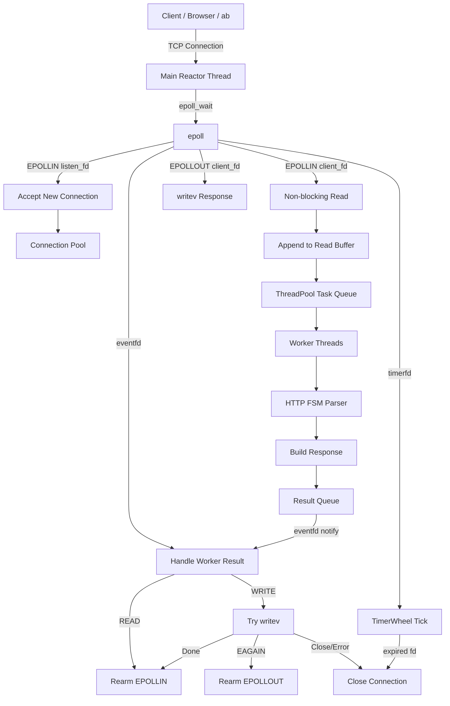
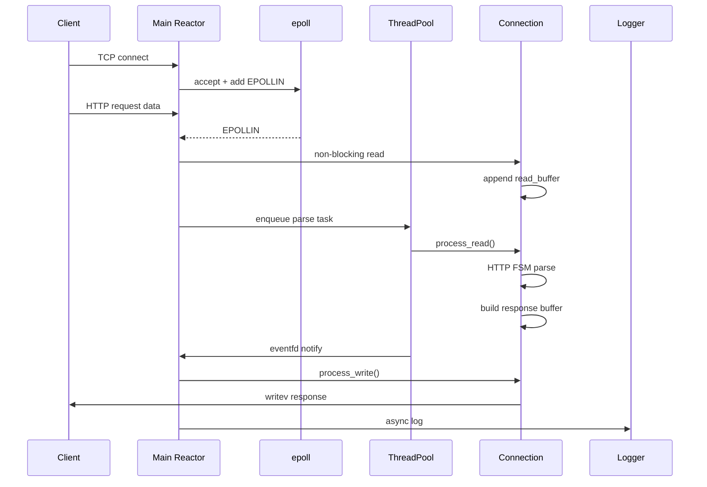
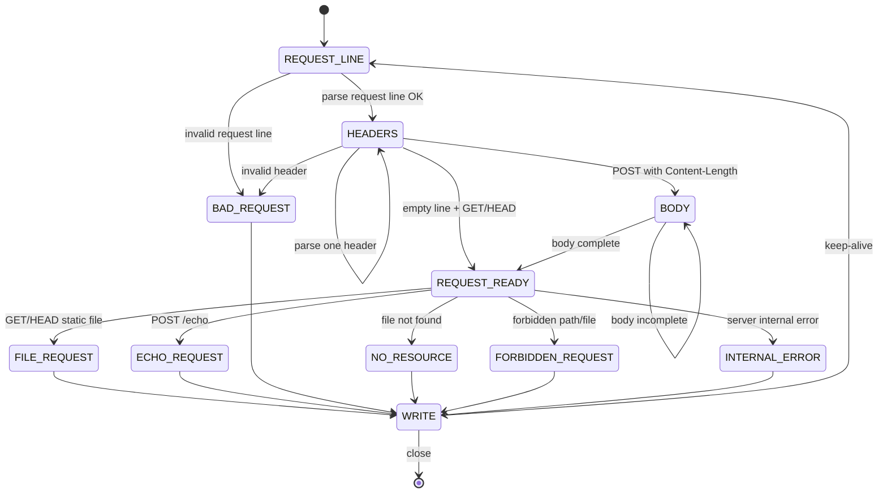
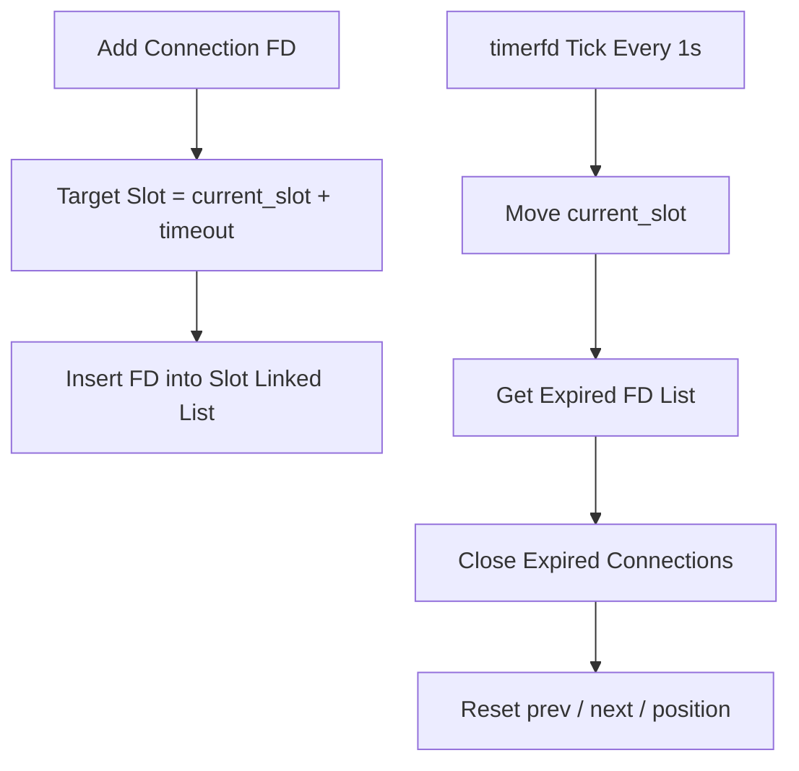

# VServer

[简体中文](./README.zh-CN.md) | English

VServer is a high-performance HTTP/1.1 Web Server written in C++ on Linux.

It is built from scratch to understand the core mechanisms behind high-concurrency network servers, including `epoll`, non-blocking I/O, thread pool scheduling, HTTP parsing, timeout management, asynchronous logging, command line configuration, and graceful shutdown.

The project can serve static files from the `Resources/` directory and can also be used as a lightweight personal technical notes/blog server.

---

## Features

### Core Network Model

- Event-driven I/O based on `epoll`
- Non-blocking socket operations
- Multi-threaded Reactor-style architecture
- Main thread handles I/O events
- Worker threads handle HTTP parsing and business logic
- `eventfd` used for worker-to-main-thread notification
- `EPOLLONESHOT` used to avoid duplicated processing of the same connection
- Supports HTTP Keep-Alive
- Supports sticky packet, half packet and basic pipeline handling

### HTTP Support

- HTTP/1.1 request parsing
- Finite State Machine based HTTP parser
- Request line parsing
- Header parsing
- Body parsing with `Content-Length`
- Supported methods:
  - `GET`
  - `HEAD`
  - `POST /echo`
- MIME type detection
- Basic path traversal protection
- Common HTTP error responses:
  - `400 Bad Request`
  - `403 Forbidden`
  - `404 Not Found`
  - `500 Internal Server Error`

### Static File Service

- Serves files from the `Resources/` directory
- Uses `stat()` to check file metadata
- Uses `mmap()` + `writev()` for static file response
- Supports common MIME types:
  - `text/html`
  - `text/css`
  - `application/javascript`
  - `image/png`
  - `image/jpeg`
  - `image/x-icon`
  - `application/json`
  - `application/pdf`

### Timeout Management

- Uses `timerfd` to generate periodic timeout ticks
- Uses Timer Wheel to manage idle connections
- Automatically closes expired connections
- Cleans timer links after removing connections

### Logging System

- Custom asynchronous logger
- Log levels:
  - `DEBUG`
  - `INFO`
  - `WARN`
  - `ERROR`
  - `FATAL`
- Timestamped logs
- Source file and line number in logs
- Background log writing thread
- Log queue with `condition_variable`
- Log file rotation by size
- New log file generated for each server run

### Configuration

Supports command line configuration:

```bash
./server \
  --port 8080 \
  --thread-nums 8 \
  --timeout 60 \
  --max-conn 65535 \
  --log-dir Logs \
  --log-level INFO \
  --log-size 10485760
```

| Option | Description | Default |
|---|---|---|
| `--port` | Listening port | `8080` |
| `--thread-nums` | Number of worker threads | `8` |
| `--timeout` | Connection timeout in seconds | `60` |
| `--max-conn` | Maximum connection count | `65535` |
| `--log-dir` | Log directory | `Logs` |
| `--log-level` | Log level | `DEBUG` |
| `--log-size` | Max log file size in bytes | `10485760` |

### Graceful Shutdown

- Handles `SIGINT`
- Handles `SIGTERM`
- Uses `std::atomic<bool>` as stop flag
- Exits the epoll loop safely
- Flushes asynchronous logger before shutdown

---

## Project Structure

```text
.
├── main.cpp
├── Connection/
│   ├── Connection.h
│   └── Connection.cpp
├── WebServer/
│   ├── WebServer.h
│   └── WebServer.cpp
├── ThreadPool/
│   ├── ThreadPool.h
│   └── ThreadPool.cpp
├── TimerWheel/
│   ├── TimerWheel.h
│   └── TimerWheel.cpp
├── Logger/
│   ├── Logger.h
│   └── Logger.cpp
├── Config/
│   ├── Config.h
│   └── Config.cpp
├── Resources/
│   └── index.html
├── Logs/
└── Makefile
```

---

## Overall Architecture



---

## Request Lifecycle



---

## HTTP Parser FSM



---

## Async Logger


---

## Timer Wheel



---

## Build

```bash
make
```

Clean build files:

```bash
make clean
```

Clean logs:

```bash
make clean-logs
```

---

## Run

Run with default configuration:

```bash
./server
```

Run with custom configuration:

```bash
./server --port 8080 --thread-nums 8 --timeout 60 --log-level INFO
```

Then open:

```text
http://127.0.0.1:8080/
```

---

## HTTP Examples

### GET

```bash
curl -i http://127.0.0.1:8080/
```

### HEAD

```bash
curl -I http://127.0.0.1:8080/index.html
```

### POST /echo

```bash
curl -i -X POST http://127.0.0.1:8080/echo --data "hello world"
```

Expected response body:

```text
hello world
```

### 404 Not Found

```bash
curl -i http://127.0.0.1:8080/not_exist.html
```

### 403 Forbidden

```bash
curl -i http://127.0.0.1:8080/../../etc/passwd
```

---

## Benchmark

Example benchmark command:

```bash
ab -n 100000 -c 500 -k http://127.0.0.1:8080/
```

Recommended benchmark mode:

```bash
./server --log-level WARN
```

Using `WARN` or `ERROR` log level is recommended during benchmarking to avoid excessive log generation.

Example metrics to record:

```text
Requests per second:
Failed requests:
Concurrency level:
Keep-Alive requests:
CPU usage:
Memory usage:
```

---

## Main Modules

### WebServer

Responsible for:

- epoll initialization
- listening socket initialization
- new connection handling
- read/write event handling
- thread pool result handling
- timer tick handling
- connection closing
- graceful shutdown

### Connection

Responsible for:

- per-connection read/write buffers
- HTTP FSM parsing
- request processing
- response construction
- `writev()` response sending
- keep-alive state management
- MIME type detection
- static file response
- POST /echo response

### ThreadPool

Responsible for:

- worker thread management
- task queue
- HTTP parsing execution
- result queue
- notifying main thread through `eventfd`

### TimerWheel

Responsible for:

- idle connection timeout management
- adding and removing connections
- closing expired connections

### Logger

Responsible for:

- asynchronous log queue
- background log writing
- log level filtering
- timestamp formatting
- log file rotation

### Config

Responsible for:

- command line argument parsing
- startup configuration

---

## Roadmap

Planned improvements:

- More complete URL decoding
- More robust path normalization with `realpath`
- Static file cache
- `sendfile()` based file transmission
- Range request support
- More complete test scripts
- Personal notes/blog static site pages

---

## Notes

This project is mainly built for learning and demonstrating:

- Linux network programming
- high-concurrency server architecture
- HTTP protocol parsing
- non-blocking I/O
- multithreaded coordination
- practical C++ systems programming

It is not intended to be a full replacement for production web servers such as Nginx, but it aims to implement and explain the core mechanisms behind them.
