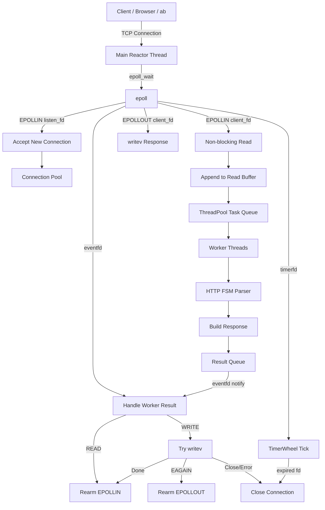
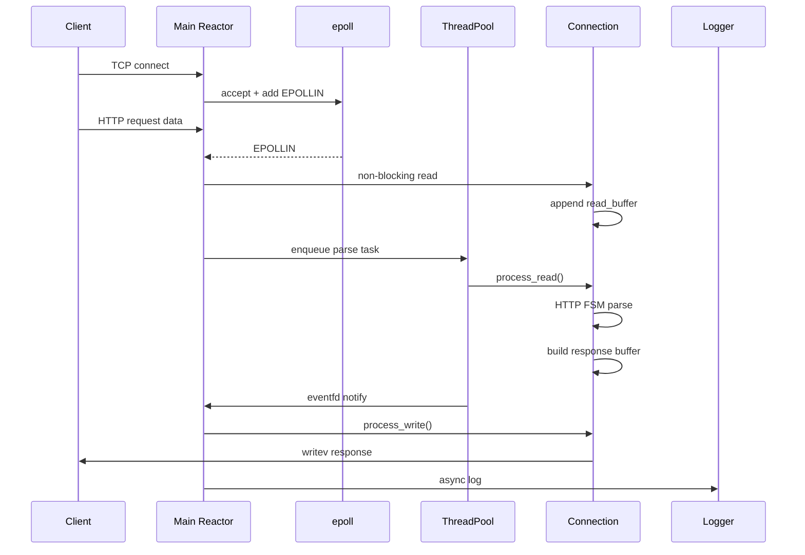
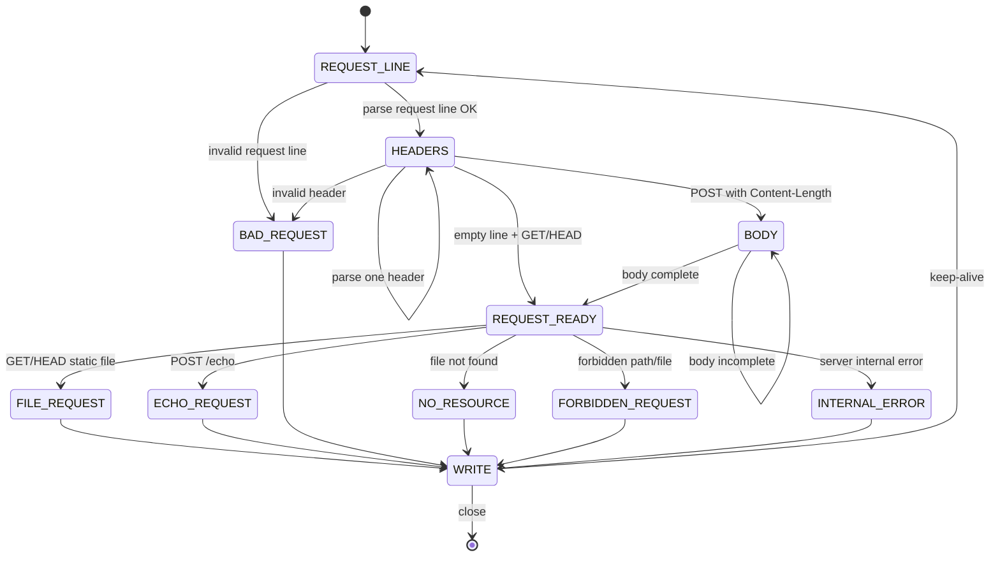
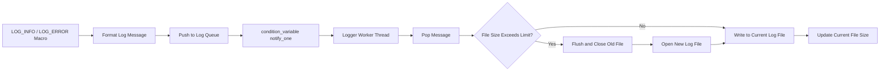
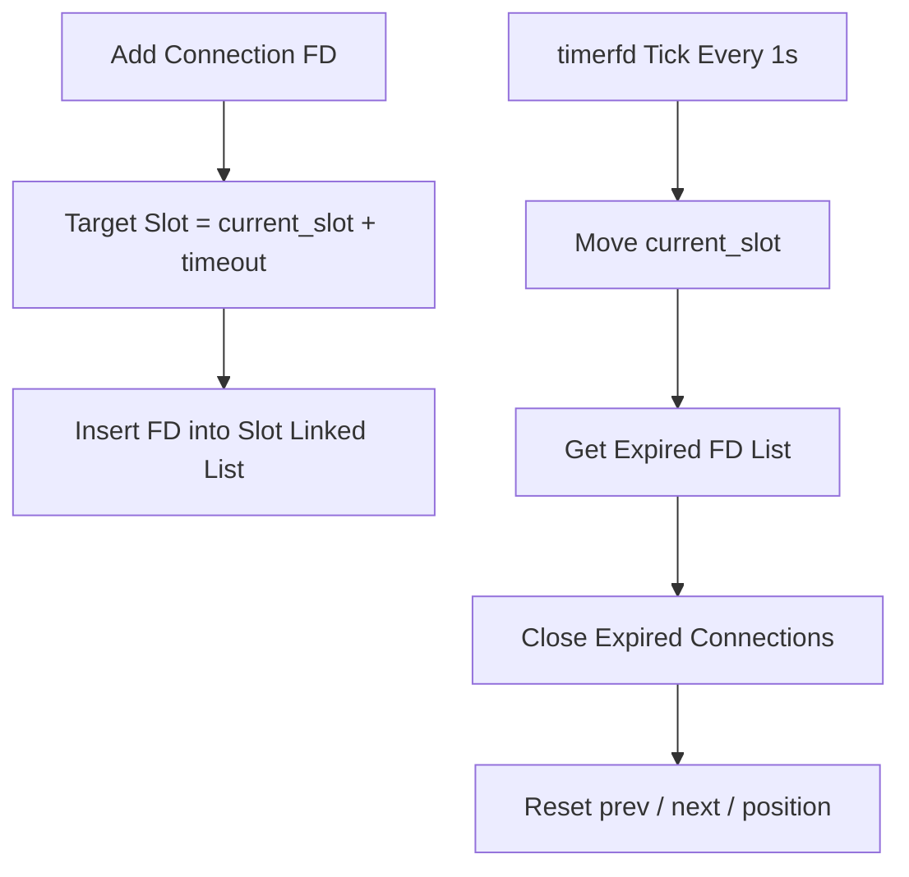

# VServer

简体中文 | [English](./README.md)

VServer 是一个基于 Linux 的高性能 HTTP/1.1 Web Server，使用 C++ 从零实现。

这个项目的目标不是简单返回 `Hello World`，而是完整学习高并发服务器的核心机制，包括 `epoll`、非阻塞 I/O、线程池、HTTP 状态机、连接超时管理、异步日志、命令行配置和优雅退出。

项目可以作为静态文件服务器使用，也可以用来托管个人技术笔记或轻量级博客页面。

---


## 功能特性

### 核心网络模型

- 基于 `epoll` 的事件驱动 I/O
- 非阻塞 socket
- 多线程 Reactor 风格架构
- 主线程负责 I/O 事件分发
- 工作线程负责 HTTP 解析与业务处理
- 使用 `eventfd` 实现工作线程到主线程的通知
- 使用 `EPOLLONESHOT` 避免同一连接被重复处理
- 支持 HTTP Keep-Alive 长连接
- 支持半包、粘包和基础 Pipeline 处理

### HTTP 支持

- HTTP/1.1 请求解析
- 基于有限状态机的 HTTP Parser
- 请求行解析
- 请求头解析
- 基于 `Content-Length` 的请求体解析
- 支持方法：
    - `GET`
    - `HEAD`
    - `POST /echo`
- MIME 类型识别
- 基础路径穿越防护
- 常见 HTTP 错误响应：
    - `400 Bad Request`
    - `403 Forbidden`
    - `404 Not Found`
    - `500 Internal Server Error`

### 静态文件服务

- 从 `Resources/` 目录提供静态资源
- 使用 `stat()` 检查文件状态
- 使用 `mmap()` + `writev()` 发送静态文件响应
- 支持常见 MIME 类型：
    - `text/html`
    - `text/css`
    - `application/javascript`
    - `image/png`
    - `image/jpeg`
    - `image/x-icon`
    - `application/json`
    - `application/pdf`

### 连接超时管理

- 使用 `timerfd` 产生周期性定时事件
- 使用时间轮管理空闲连接
- 自动关闭超时连接
- 连接从时间轮移除后会清理链表指针状态，避免 stale fd 和重复 timeout

### 日志系统

- 自定义异步日志系统
- 支持日志等级：
    - `DEBUG`
    - `INFO`
    - `WARN`
    - `ERROR`
    - `FATAL`
- 日志包含时间戳
- 日志包含源文件与行号
- 后台线程异步写日志
- 使用 `condition_variable` 唤醒日志线程
- 支持按文件大小滚动日志
- 每次服务器启动生成新的日志文件

### 命令行配置

支持通过命令行参数配置服务器：

```bash
./server \
  --port 8080 \
  --thread-nums 8 \
  --timeout 60 \
  --max-conn 65535 \
  --log-dir Logs \
  --log-level INFO \
  --log-size 10485760
```

| 参数            | 说明                           | 默认值     |
| --------------- | ------------------------------ | ---------- |
| `--port`        | 监听端口                       | `8080`     |
| `--thread-nums` | 工作线程数量                   | `8`        |
| `--timeout`     | 连接超时时间，单位秒           | `60`       |
| `--max-conn`    | 最大连接数                     | `65535`    |
| `--log-dir`     | 日志目录                       | `Logs`     |
| `--log-level`   | 日志等级                       | `DEBUG`    |
| `--log-size`    | 单个日志文件最大大小，单位字节 | `10485760` |

### 优雅退出

- 支持 `SIGINT`
- 支持 `SIGTERM`
- 使用 `std::atomic<bool>` 作为退出标志
- 主循环安全退出
- 退出前 flush 异步日志

---

## 项目结构

```text
.
├── main.cpp
├── Connection/
│   ├── Connection.h
│   └── Connection.cpp
├── WebServer/
│   ├── WebServer.h
│   └── WebServer.cpp
├── ThreadPool/
│   ├── ThreadPool.h
│   └── ThreadPool.cpp
├── TimerWheel/
│   ├── TimerWheel.h
│   └── TimerWheel.cpp
├── Logger/
│   ├── Logger.h
│   └── Logger.cpp
├── Config/
│   ├── Config.h
│   └── Config.cpp
├── Resources/
│   └── index.html
├── Logs/
└── Makefile
```

---

## 整体架构



---

## 请求处理流程



---

## HTTP 状态机



---

## 异步日志流程



---

## 时间轮



---

## 构建

```bash
make
```

清理编译产物：

```bash
make clean
```

清理日志文件：

```bash
make clean-logs
```

---

## 运行

使用默认配置运行：

```bash
./server
```

使用自定义配置运行：

```bash
./server --port 8080 --thread-nums 8 --timeout 60 --log-level INFO
```

浏览器访问：

```text
http://127.0.0.1:8080/
```

---

## HTTP 测试示例

### GET

```bash
curl -i http://127.0.0.1:8080/
```

### HEAD

```bash
curl -I http://127.0.0.1:8080/index.html
```

### POST /echo

```bash
curl -i -X POST http://127.0.0.1:8080/echo --data "hello world"
```

预期响应体：

```text
hello world
```

### 404 Not Found

```bash
curl -i http://127.0.0.1:8080/not_exist.html
```

### 403 Forbidden

```bash
curl -i http://127.0.0.1:8080/../../etc/passwd
```

---

## 压测

示例压测命令：

```bash
ab -n 100000 -c 500 -k http://127.0.0.1:8080/
```

压测时建议使用较高日志等级，避免大量 INFO 日志影响结果：

```bash
./server --log-level WARN
```

建议记录以下指标：

```text
Requests per second:
Failed requests:
Concurrency level:
Keep-Alive requests:
CPU usage:
Memory usage:
```

---

## 核心模块

### WebServer

负责：

- epoll 初始化
- 监听 socket 初始化
- 新连接接收
- 读写事件处理
- 线程池结果处理
- 定时器 tick 处理
- 连接关闭
- 优雅退出

### Connection

负责：

- 每个连接的读写缓冲区
- HTTP 状态机解析
- 请求处理
- 响应构造
- `writev()` 响应发送
- keep-alive 状态管理
- MIME 类型识别
- 静态文件响应
- POST /echo 响应

### ThreadPool

负责：

- 工作线程管理
- 任务队列
- HTTP 解析任务执行
- 结果队列
- 通过 `eventfd` 通知主线程

### TimerWheel

负责：

- 空闲连接超时管理
- 添加和移除连接
- 关闭超时连接

### Logger

负责：

- 异步日志队列
- 后台线程写日志
- 日志等级过滤
- 时间戳格式化
- 日志文件滚动

### Config

负责：

- 命令行参数解析
- 服务器启动配置

---

## 后续计划

计划改进：

- 更完整的 URL decode
- 使用 `realpath` 做更严谨的路径规范化
- 静态文件缓存
- 基于 `sendfile()` 的文件传输
- Range 请求支持
- 更完整的测试脚本
- 个人笔记 / blog 静态页面

---

## 项目定位

这个项目主要用于学习和展示：

- Linux 网络编程
- 高并发服务器架构
- HTTP 协议解析
- 非阻塞 I/O
- 多线程协作
- C++ 系统编程实践

它不是为了替代 Nginx 这类生产级 Web Server，而是为了从零实现并理解其背后的核心机制。