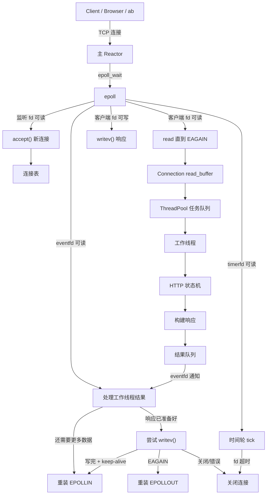
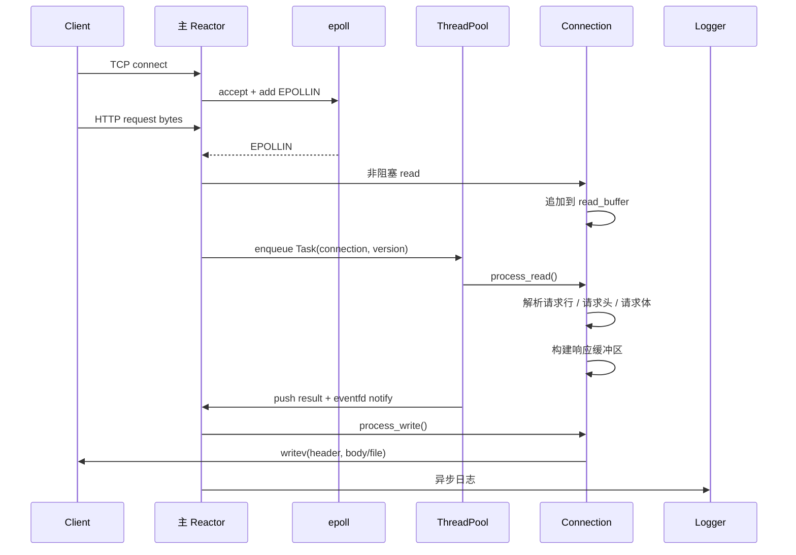
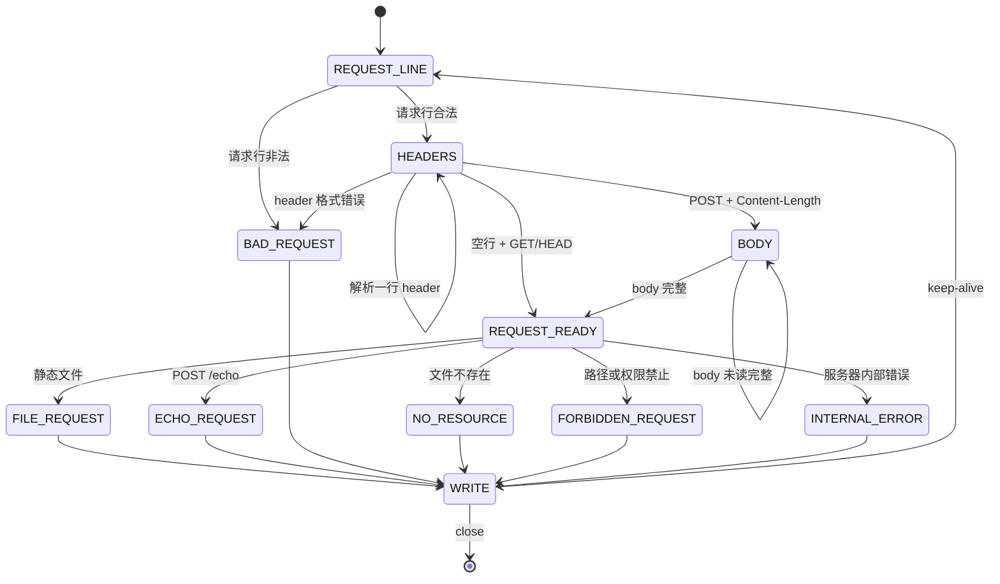
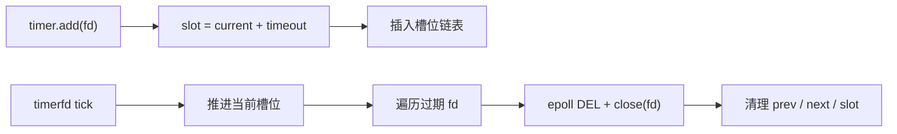

# VWebServer

简体中文 | [English](./README.md)


VWebServer 是一个使用 C++14 从零实现的 Linux HTTP/1.1 Web Server。它的重点是把高并发服务器背后的关键机制完整跑通：非阻塞 socket、`epoll`、边缘触发事件分发、线程池任务调度、HTTP 状态机解析、空闲连接超时管理、静态文件响应、异步日志、命令行配置和优雅退出。

本项目的目的不是替代 Nginx，而是一个可阅读、可运行、能解释清楚底层链路的 C++ 系统编程项目。

## 项目亮点

- 基于 `epoll` 的事件驱动主循环
- 监听 socket 和客户端 socket 均使用非阻塞模式
- 使用 `EPOLLET` 边缘触发减少重复事件通知
- 客户端读事件使用 `EPOLLONESHOT`，避免同一连接被重复处理
- 使用线程池执行 HTTP 解析和响应准备
- 工作线程通过 `eventfd` 通知主 Reactor 处理结果
- 支持 HTTP/1.1 `GET`、`HEAD` 和 `POST /echo`
- 支持 Keep-Alive 长连接复用
- 增量式 HTTP Parser，能处理半包、粘包和简单 Pipeline 请求
- 从 `Resources/` 目录提供静态文件服务
- 使用 `mmap()` + `writev()` 发送响应头和文件内容
- 使用 `timerfd` 产生周期性定时事件
- 使用时间轮清理空闲超时连接
- 每个连接维护版本号，避免 fd 复用后旧任务误操作新连接
- 自定义异步日志，支持日志等级过滤和按大小滚动
- 支持端口、线程数、超时时间、最大连接数、日志目录、日志等级、日志大小等命令行配置
- 支持 `SIGINT` / `SIGTERM` 优雅退出

## 整体架构

VWebServer 采用单主 Reactor + 线程池模型。

主线程持有监听 socket、`epoll`、定时器、连接表和所有 socket 生命周期操作。工作线程只消费连接任务：执行 HTTP 状态机解析、构建响应信息，然后把处理完成的连接放入结果队列。结果队列通过 `eventfd` 唤醒主线程，因此 socket 写入和 epoll 事件重装仍集中在主 Reactor 中完成。



## 请求处理流程



## HTTP 支持

HTTP Parser 是一个围绕请求行、请求头和可选请求体构建的小型有限状态机。



支持能力：

| 类型 | 说明 |
|---|---|
| 请求方法 | `GET`、`HEAD`、`POST /echo` |
| 请求体解析 | 基于 `Content-Length` |
| 静态根目录 | `Resources/` |
| 默认页面 | `/` 映射到 `/index.html` |
| 路径安全 | 拒绝 `..` 和 `%2e%2e` 路径穿越 |
| 错误响应 | `400`、`403`、`404`、`500` |
| MIME 类型 | `html`、`css`、`js`、`png`、`jpg/jpeg`、`gif`、`ico`、`svg`、`txt`、`json`、`pdf`，默认 `application/octet-stream` |

## 静态文件响应

对于 `GET` 请求，VWebServer 会先使用 `stat()` 检查文件状态，拒绝目录和无读取权限的文件，然后通过 `mmap()` 将文件映射到内存，最后使用 `writev()` 聚合发送响应头和文件内容。

对于 `HEAD` 请求，服务器只返回响应头，不发送文件体。

对于 `POST /echo`，服务器会把请求体按 `text/plain` 原样返回。

## 超时管理

空闲连接由时间轮管理。`timerfd` 每秒触发一次，主线程读取到定时事件后推进时间轮槽位，并关闭当前槽位中过期的连接。连接在读事件处理期间会先从时间轮移除，重新进入等待状态后再加入时间轮。



## 日志系统

Logger 是一个单例异步日志系统。业务线程只负责格式化日志并推入队列，后台线程负责写文件。日志支持 `DEBUG`、`INFO`、`WARN`、`ERROR`、`FATAL` 五个等级，包含时间戳、源文件和行号，并在单个日志文件超过配置大小后自动滚动生成新文件。

## 项目结构

```text
.
├── main.cpp
├── Makefile
├── Config/
│   ├── Config.h
│   └── Config.cpp
├── Connection/
│   ├── Connection.h
│   └── Connection.cpp
├── Logger/
│   ├── Logger.h
│   └── Logger.cpp
├── ThreadPool/
│   ├── ThreadPool.h
│   └── ThreadPool.cpp
├── TimerWheel/
│   ├── TimerWheel.h
│   └── TimerWheel.cpp
├── WebServer/
│   ├── WebServer.h
│   └── WebServer.cpp
├── Resources/
│   ├── index.html
│   ├── favicon.ico
│   └── readme-hero.svg
└── Logs/
```

## 构建

环境要求：

- Linux
- 支持 C++14 的 `g++`
- `make`
- Linux/POSIX API：`epoll`、`eventfd`、`timerfd`、`mmap`、`writev`

构建：

```bash
make
```

清理可执行文件：

```bash
make clean
```

清理日志：

```bash
make clean-logs
```

## 运行

默认配置：

```bash
./server
```

自定义配置：

```bash
./server \
  --port 8080 \
  --thread-nums 8 \
  --timeout 60 \
  --max-conn 65535 \
  --log-dir Logs \
  --log-level INFO \
  --log-size 10485760
```

然后访问：

```text
http://127.0.0.1:8080/
```

命令行参数：

| 参数 | 说明 | 默认值 |
|---|---|---|
| `--port` | 监听端口 | `8080` |
| `--thread-nums` | 工作线程数量 | `8` |
| `--timeout` | 空闲连接超时时间，单位秒 | `60` |
| `--max-conn` | 连接表最大容量 | `65535` |
| `--log-dir` | 日志目录 | `Logs` |
| `--log-level` | 最低日志等级 | `DEBUG` |
| `--log-size` | 单个日志文件最大大小，单位字节 | `10485760` |

## 快速验证

```bash
curl -i http://127.0.0.1:8080/
curl -I http://127.0.0.1:8080/index.html
curl -i -X POST http://127.0.0.1:8080/echo --data "hello world"
curl -i http://127.0.0.1:8080/not_exist.html
curl -i http://127.0.0.1:8080/../../etc/passwd
```

`POST /echo` 的预期响应体：

```text
hello world
```

## 压测

使用 ApacheBench 示例：

```bash
ab -n 100000 -c 500 -k http://127.0.0.1:8080/
```

压测时建议提高日志等级，减少日志写入对结果的影响：

```bash
./server --log-level WARN
```

建议记录：

```text
Requests per second:
Failed requests:
Concurrency level:
Keep-Alive requests:
CPU usage:
Memory usage:
```

## 核心模块

| 模块 | 职责 |
|---|---|
| `WebServer` | 初始化 epoll、监听 socket、timer、线程池和 logger；处理 accept、read、write、timer、worker result 和连接关闭 |
| `Connection` | 管理单个 fd 的读写缓冲区、HTTP 解析状态、响应构造、Keep-Alive、MIME 识别、静态文件映射和 `writev()` 写入进度 |
| `ThreadPool` | 执行 HTTP 解析任务，把完成的连接放入结果队列，并通过 `eventfd` 唤醒主 Reactor |
| `TimerWheel` | 按槽位管理空闲客户端 fd，并在定时 tick 时关闭超时连接 |
| `Logger` | 异步日志队列、后台写文件、日志等级过滤、时间戳格式化和按大小滚动 |
| `Config` | 解析命令行启动参数 |

## 后续计划

- 更完整的 URL decode
- 使用 `realpath` 做更严格的路径规范化
- 静态文件缓存
- 基于 `sendfile()` 的响应路径
- HTTP Range 请求支持
- 更完整的自动化测试脚本
- 继续完善 `Resources/` 下的个人笔记 / blog 静态页面

## 项目定位

VWebServer 主要用于学习和展示。它的代码规模足够小，适合逐个模块读完；同时又覆盖了真实网络服务器绕不开的问题：事件循环、非阻塞 I/O、连接状态复用、线程协作、超时清理、响应缓冲和退出流程。
